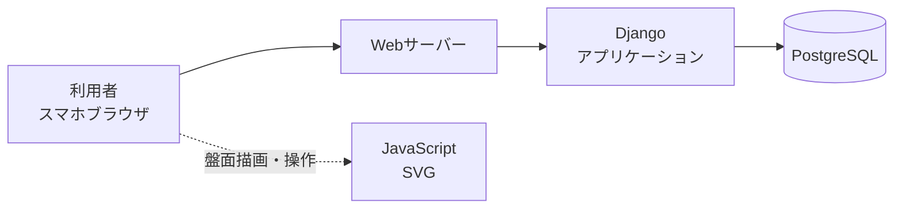
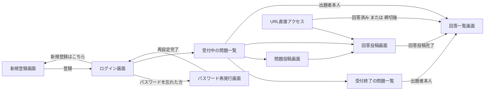

# 基本設計書

> 本書は第1イテレーションの範囲を対象とする。
> 対象要件: F-01〜F-11
> 次期以降の機能(既存詰碁の取り込み、対局からの局面切り出し、複数手の表示)は対象外とする。

---

## 1. システム構成

### 1.1 構成図

### 1.2 技術スタック

| 区分 | 採用技術 | 選定理由 |
|---|---|---|
| バックエンド | Django (Python) | Pythonでレビューしやすい |
| データベース | PostgreSQL | Djangoとの標準的な組み合わせ |
| フロントエンド | Djangoテンプレート + 素のJavaScript | フレームワークを使わず、生成コードをレビューしやすくする |
| アイコン | Font Awesome Free 6.7.2 | 絵文字・記号の文字は端末のフォントによって表示が崩れるため。外部CDNは使わず、`static/vendor/fontawesome/`に同梱して配信する |
| 盤面描画 | JavaScript (SVG) ※自作 | 外部ライブラリに依存せず、全て自分でレビューできる状態にするため。選定理由は「4.1 盤面 (goban_*.js)」を参照 |
| 静的ファイル配信 | WhiteNoise | 本番のWebサーバー(gunicorn)はCSS・JavaScriptを配信しないため、アプリ側で配信する。CDNや別サーバーが不要で、Railway・Docker(AWS)のどちらでも同じ構成で動く |
| テスト | Django標準のテスト + Playwright(E2E) | サーバー側の処理はDjango標準のテストで、画面操作はPlaywrightでブラウザ(Chromium)を実際に動かして確認する |
| ホスティング | Railway | 小規模利用ではコストを抑えられる。第2イテレーション以降、本番環境はAWS(Docker)へ移行する予定 |
| メール送信 | Amazon SES | 登録確認とパスワード再発行のリンク送信に使用 |

### 1.3 採用しなかった構成

検討した代替案とその理由は `docs/not_doing.md` を参照。

---

## 2. 画面設計

### 2.1 画面一覧

| 画面コード | 画面名 | URL | 概要 | ログイン | 対応要件 | 詳細設計 |
|---|---|---|---|---|---|---|
| 3a | 新規登録画面 | /signup、/signup/sent、/signup/activate/(token) | アカウントを作成する。登録メール送信後の確認案内と、確認メールのリンクによる有効化もこの画面に含む | 不要 | F-09 | design/3a_新規登録画面.md |
| 3b | ログイン画面 | /login | 認証を行う | 不要 | F-10 | design/3b_ログイン画面.md |
| - | - | /logout | 認証を解除する | 必須 | F-10 | design/M_共通メニュー.md(ログアウトボタン) |
| - | - | / | 受付中の問題一覧へリダイレクトする。未ログインの場合は、そこからログイン画面へリダイレクトされる | 不要 | - | - |
| 6a | パスワード再発行画面 | /password_reset、/password_reset/confirm/(uidb64)/(token) | 登録済みメールアドレスにリセット用URLを送信し、そのURLから新しいパスワードを設定する | 不要 | F-11 | design/6a_パスワード再発行画面.md |
| 4a | 問題投稿画面 | /problems/new、/problems/(id)/created | 盤面に石を配置して問題を作成する。投稿後の共有手段の提示もこの画面に含む | 必須 | F-01, F-02 | design/4a_問題投稿画面.md |
| 2a | 回答投稿画面 | /problems/(id)/answer | 盤面に着手を示し、ニックネーム・棋力・コメントを投稿する | 不要 | F-03 | design/2a_回答投稿画面.md |
| 2b | 回答一覧画面 | /problems/(id) | 全員の回答投稿を閲覧する | 不要 | F-04 | design/2b_回答一覧画面.md |
| 2c | 受付中の問題一覧 | /problems/active | 自分が作成した問題のうち、受付中のものを表示する。一覧内で受付終了・削除・共有ができる | 必須 | F-02, F-05, F-06, F-08 | design/2c_受付中の問題一覧.md |
| 2d | 受付終了の問題一覧 | /problems/archive | 自分が作成した問題のうち、締切を過ぎたもの、または出題者が受付を終了させたものを表示する。一覧内で削除・共有ができる | 必須 | F-02, F-07, F-08 | design/2d_受付終了の問題一覧.md |
| M | 共通メニュー | -(各画面のヘッダーに組み込む) | 画面遷移用のメニュー(「4.3 共通メニュー」を参照) | 必須(ログイン中のみ表示) | - | design/M_共通メニュー.md |

> 画面コードはデザインPDF(`docs/design/screens_wireframe/`)で使われていた番号を踏襲する。共通メニューはMとする。

### 2.2 画面遷移図

> 各一覧画面では、受付終了・削除・共有は画面遷移を伴わず、一覧内の操作として完結する。

> 共有URLは回答投稿画面を指す。回答一覧画面の閲覧可否は「3.1 回答一覧の公開制御」に従う。
> 出題者本人は、自分が作成した問題について回答なしで回答一覧画面へ遷移できる。

---

## 3. 要件の実現方式

> 用語: 「受付終了」は、締切を過ぎた状態と、出題者が締切前に受付を終了させた状態の両方を指す。
> 出題者の操作によるものだけを指す場合は「出題者が受付を終了させる(させた)」と書き、締切を過ぎた場合と区別する。

| 要件 | 実現方式 |
|---|---|
| F-01 出題したい局面を自分で作成する | 盤面をタップして石を配置し、局面として保存する。石の配置時のルール判定は共通コンポーネント(「4.1 盤面 (goban_*.js)」)に従う |
| F-02 作成した問題を仲間に閲覧させる | 問題ごとにUUIDを主キーとしたURLを発行し、そのURLを共有する。連番を用いないことで、URLを知らない第三者による総当たりを防ぐ |
| F-03 問題に対する回答と、その意図を投稿する | 盤面をタップして着手を1手示し、回答投稿として保存する。石の配置時のルール判定は共通コンポーネント(「4.1 盤面 (goban_*.js)」)に従う。投稿の頻度は「3.3 回答投稿の頻度制限」に従う。同じブラウザからの回答は1つの問題につき1回までとし、回答済みかどうかはセッションで判定する |
| F-04 同じ問題に対する他の人の回答投稿を閲覧する | 閲覧の可否は「3.1 回答一覧の公開制御」に従う |
| F-05 回答の受付を締切前に終了する | 出題者が締切前に受付を終了させることができる。受付を終了させた問題は受付終了の問題一覧へ移動する。寄せられた回答投稿はそのまま保持する |
| F-06 自分が作成した問題のうち、受付中のものを参照する | 自分が作成した問題のうち、締切日時が未到来で、かつ出題者が受付を終了させていないものを絞り込んで表示する |
| F-07 自分が作成した問題のうち、締切を過ぎたもの、または受付を終了させたものを参照する | 自分が作成した問題のうち、締切日時を過ぎたもの、または出題者が受付を終了させたものを絞り込んで表示する |
| F-08 作成した問題を削除する | 各一覧画面内で削除操作を行う。問題を削除すると、紐づく回答投稿も合わせて削除する。専用画面は持たない |
| F-09 アカウントを作成する | Djangoの標準認証機能を使用する。メールの送信回数は「3.2 メール送信回数の制限」に従う |
| F-10 認証する | Djangoの標準認証機能を使用する |
| F-11 パスワードを忘れた場合に再設定する | 登録済みメールアドレス宛にリセット用URLを送信し、そのURLから新しいパスワードを設定する。メールの送信回数は「3.2 メール送信回数の制限」に従う |

### 3.1 回答一覧の公開制御

出題者は問題作成時に、以下のいずれかの公開方式を選択する。
この選択は締切前の挙動のみを左右する。締切を過ぎるか、出題者が受付を終了させた後は、
公開方式によらず誰でも閲覧できる(下記の閲覧条件を参照)。

| 公開方式 | 締切前の内容 |
|---|---|
| 締切後に公開URLをシェア | 出題者本人以外には閲覧させない |
| 回答後に公開リンクを表示 | 自分が回答した時点で、他の投稿者の回答投稿を閲覧できる |

閲覧には以下のいずれかの条件を満たす必要がある。

- 閲覧者が出題者本人であること(ログイン・DBで判定)
- 締切を過ぎているか、出題者が受付を終了させていること(公開方式によらず、誰でも閲覧可能になる)
- 締切前かつ公開方式が「回答後に公開リンクを表示」であり、当該問題に回答済みであること(セッションで判定)

回答済みの判定は端末・ブラウザに紐づくため、別の端末からアクセスした場合は
未回答として扱われる。

> セッションの保持期間は4ヶ月を既定とし、回答済み判定・ログイン状態の保持を含む全セッションに適用する。
> 画面ごとに短くする場合(例: ログイン画面の「ログイン状態を保持する」チェックボックス)は、各画面の詳細設計で定める。

### 3.2 メール送信回数の制限

迷惑送信を防ぐため(要件定義書「6. 非機能要件」)、メールの送信回数を以下のとおり制限する。

| 項目 | 内容 |
|---|---|
| 対象 | 登録確認メール(F-09。再登録・再送を含む)、パスワード再発行メール(F-11。再送を含む) |
| 数える単位 | 送信先メールアドレスごと・機能ごと(登録確認と再発行は別々に数える) |
| 上限 | 直近24時間で5回。6回目以降は送信しない |
| 数え方 | 送信のたびに、送信先・機能・日時を記録する(テーブル定義書「2.5 dokoutsu_emailsendlog」)。直近24時間の記録を数え、24時間より古い記録は数えるときに削除する |
| 登録のないメールアドレス | パスワード再発行では、登録のないメールアドレスへの要求も同じように数え、上限に達したら同じ表示にする(登録の有無を推測させないため) |
| 上限に達したときの表示 | 「送信回数の上限に達しました。時間をおいてもう一度お試しください」 |

### 3.3 回答投稿の頻度制限

回答投稿はログインなしで行えるため、荒らしによる大量投稿を防ぐ(要件定義書「6. 非機能要件」)。
囲碁クラブの会場のWi-Fiやスマートフォン回線では複数の利用者が同じIPアドレスになりうるため、通常の利用を妨げないゆるめの上限とする。

| 項目 | 内容 |
|---|---|
| 対象 | 回答投稿(F-03) |
| 数える単位 | 投稿元のIPアドレスごと・問題ごと |
| 上限 | 直近10分間で10件。11件目以降は投稿を受け付けない |
| IPアドレスの取得 | Railway上では、リクエストヘッダー`X-Forwarded-For`の先頭の値を使う。Railwayの中継サーバーは利用者が送った同名のヘッダーを取り除き、実際の接続元を先頭に入れるため、利用者は偽装できない。それ以外の環境では接続元のアドレスを使う |
| 数え方 | 投稿を受け付けるたびに、IPアドレス・問題・日時を記録する(テーブル定義書「2.6 dokoutsu_answerpostlog」)。直近10分間の記録を数え、10分より古い記録は数えるときに削除する。IPアドレスは利用者に結びつく情報のため、制限に必要な期間を過ぎたら残さない |
| 上限に達したときの表示 | 「短時間に多くの回答が投稿されたため、受け付けられませんでした。時間をおいてもう一度お試しください」 |

---

## 4. 共通コンポーネント

### 4.1 盤面 (goban_*.js)

複数の画面で共用するため、独立したコンポーネントとして実装する。

| 項目 | 内容 |
|---|---|
| 用途(操作あり) | 問題投稿画面(石を配置する)、回答投稿画面(着手を1手示す) |
| 用途(表示のみ) | 回答一覧画面、問題投稿画面(出題完了後)、受付中の問題一覧、受付終了の問題一覧 |
| 構成 | 盤面の状態とルール、描画(タップ位置の計算を含む)、画面ごとの操作の3つに分けて実装する。画面ごとの操作は、使う画面でだけ読み込む |
| 実装 | 外部ライブラリを使わず自作する。盤面の状態とルール(石を置く・取る・自殺手の判定)をクラス(Board)にまとめ、描画と画面ごとの操作は関数で実装する |
| 描画方式 | SVG |
| 盤サイズ | 19路 |
| 提供する機能 | 局面の描画、石の配置、着手の重ね表示、囲碁のルールに基づく取り・自殺手の判定 |
| 保持する状態 | 盤面19×19の各交点の状態(空点・黒・白) |
| 操作性の要求 | スマートフォンで正確に交点を指定できること |
| 対応要件 | F-01(問題作成)、F-03(回答)の両方で、この判定ロジックを共通利用する |

> 一覧画面・問題投稿画面(出題完了後)ではサムネイルとして表示するのみで、操作は受け付けない。
> 表示サイズの違いへの対応方法は、各画面の詳細設計で定める。

**取り・自殺手の判定ルール(F-01・F-03共通)**

| ルール | 内容 |
|---|---|
| 取り | 石を置いた際、隣接する相手の石のつながり(連)をたどり、その周囲の空点が残っていない場合、その連を盤上から取り除く。演出は行わず、対象の石を盤面から消すのみ |
| 自殺手 | 石を置いた結果、自分の石の連の周囲に空点が残らない場合、その配置を受け付けない |

**SVGを選定した理由**

| 観点 | 内容 |
|---|---|
| タップ判定 | 盤面全体でタップ位置を受け取り、座標から最も近い交点を割り出す。押している間のガイド線表示などで盤面を描き直しても、タップ判定が途切れない |
| 再描画 | 石の追加・削除のたびに盤面全体を描き直す。交点361個程度であれば描き直しても表示速度に影響がなく、描画処理を1か所にまとめられるためプログラムが単純になる |
| スタイル指定 | CSSで色・サイズを指定できるため、CSS変数による管理方針と整合する |
| 表示品質 | 画面幅に応じて拡大縮小しても描画が劣化しない |

> 交点361個・石361個程度の規模では、SVGの描画性能が問題になることはない。

> 具体的な操作方式(タップ回数、スナップ処理など)は、各画面の詳細設計で定める。

### 4.2 共有機能

複数の画面(問題投稿画面(出題完了後)、受付中の問題一覧、受付終了の問題一覧)で共用する。

| 項目 | 内容 |
|---|---|
| 対応要件 | F-02(問題を他の人に見せる) |
| 実現方式 | Web Share API(OS標準の共有シート)と、主要サービス向けの個別共有リンクを併用する |
| 共有されるURL | 回答投稿画面を指す |

> 個別共有リンクの対象サービス、ボタンの配置は各画面の詳細設計で定める。

### 4.3 共通メニュー

ログイン後の全画面のヘッダーで共用する、画面遷移用のメニュー。

| 項目 | 内容 |
|---|---|
| 画面コード | M |
| 対応要件 | 画面遷移の共通導線(個別の機能要件には対応しない) |
| 表示位置 | ヘッダーのアイコンをタップして開くオーバーレイ |
| 掲載する遷移先 | 問題投稿画面、受付中の問題一覧、受付終了の問題一覧、ログアウト |
| 表示条件 | ログイン中の場合のみ表示する。未ログインの場合、画面を問わず表示しない |
| 詳細設計 | design/M_共通メニュー.md |

> 回答投稿画面・回答一覧画面はログイン不要で到達できるが、ログイン中の状態で開いた場合は共通メニューを表示する。
> ログイン画面・新規登録画面・パスワード再発行画面は未ログイン専用の画面のため、共通メニューを表示しない。

> メニュー項目の文言・並び順は `docs/design/screens_wireframe/M_共通メニュー_design.pdf` を参照。
> 各画面の詳細設計書でヘッダー領域にこのコンポーネントを含む旨を記載する。

---

## 5. 認証方式

| 項目 | 内容 |
|---|---|
| 認証基盤 | Djangoの標準認証を使用する |
| 認証の要否 | 要件定義書「5. 認証」に従う |
| 画面ごとの要否 | 本書「2.1 画面一覧」の「ログイン」列を参照 |
