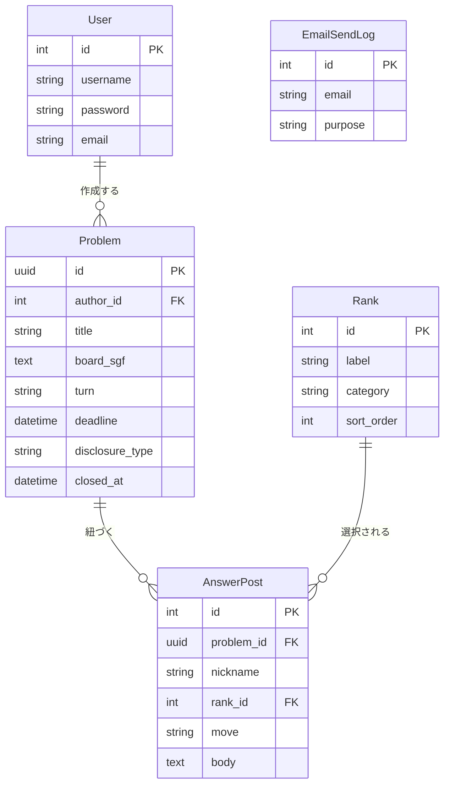

# テーブル定義書

## 1. 全体

### 1.1 ER図

> ER図は関係性の把握に必要なカラムのみ示す。作成日時・更新日時
> (`created_at`、`updated_at`)、有効/無効の状態(`is_active`)などの
> 管理系カラムは省略する。全カラムは「2. テーブル定義」を参照。

### 1.2 テーブル一覧

| テーブル名 | モデル名 | 概要 |
|---|---|---|
| auth_user | User | 利用者(Djangoの標準認証を利用) |
| dokoutsu_problem | Problem | 問題(タイトル・局面データ・締切・公開方式) |
| dokoutsu_answerpost | AnswerPost | 回答投稿(着手・コメント・ニックネーム・棋力) |
| dokoutsu_rank | Rank | 棋力の選択肢(級・段の表示名と並び順) |
| dokoutsu_emailsendlog | EmailSendLog | メール送信の記録(送信回数の制限に使用。他のテーブルとは関連を持たない) |

### 1.3 命名規則

| 項目 | 規則 |
|---|---|
| テーブル名 | Djangoの標準に従う(アプリ名_モデル名) |
| カラム名 | スネークケース |
| 主キー | id |
| 外部キー | (参照先モデル名)_id |
| 作成日時 | created_at |
| 更新日時 | updated_at |

> 外部キーの例外: 参照先が同一でも役割が複数存在しうる場合、参照先名ではなく
> 役割を示す名前を使ってよい(例: `author_id` — auth_user を参照する出題者)。

---

## 2. テーブル定義

### 2.1 auth_user(利用者)

Djangoの標準認証機能が自動生成するテーブル。独自の拡張は行わない。

| カラム名 | 型 | NULL | 説明 |
|---|---|---|---|
| id | SERIAL | NOT NULL | 主キー |
| username | VARCHAR(150) | NOT NULL | ログインID |
| password | VARCHAR(128) | NOT NULL | ハッシュ化されたパスワード |
| email | VARCHAR(254) | NOT NULL | メールアドレス。本アプリでは必須とする |
| is_active | BOOLEAN | NOT NULL | 有効/無効の状態 |
| date_joined | TIMESTAMP | NOT NULL | 登録日時 |

> 上記はDjango標準カラムの一部。本アプリで使用するのは `username`、`password`、`email`。

### 2.2 dokoutsu_problem(問題)

| カラム名 | 型 | NULL | 初期値 | 説明 |
|---|---|---|---|---|
| id | UUID | NOT NULL | - | 主キー |
| author_id | INTEGER | NOT NULL | - | 出題者。auth_user への外部キー。ON DELETE CASCADE |
| title | VARCHAR(100) | NOT NULL | - | 問題のタイトル |
| board_sgf | TEXT | NOT NULL | - | 局面データ。SGF形式で「AB[黒石の座標]…AW[白石の座標]…」の形とし、座標は列・行をa〜sの1文字ずつで表す。形式はアプリ側で検証する(詳細設計書 4a「5. エラーケース」) |
| turn | VARCHAR(5) | NOT NULL | - | 回答する手番。`black` / `white` |
| deadline | TIMESTAMP | NOT NULL | - | 回答の締切日時 |
| disclosure_type | VARCHAR(20) | NOT NULL | - | 公開方式。`after_deadline` / `after_answer` |
| closed_at | TIMESTAMP | NULL | NULL | 締切前に受付を終了した日時 |
| created_at | TIMESTAMP | NOT NULL | - | 作成日時 |
| updated_at | TIMESTAMP | NOT NULL | - | 更新日時 |

> 主キーにUUIDを使用する理由、受付状態の判定方法は
> 基本設計書「3. 要件の実現方式」を参照。

### 2.3 dokoutsu_answerpost(回答投稿)

| カラム名 | 型 | NULL | 初期値 | 説明 |
|---|---|---|---|---|
| id | SERIAL | NOT NULL | - | 主キー |
| problem_id | UUID | NOT NULL | - | 対象の問題。dokoutsu_problem への外部キー。ON DELETE CASCADE |
| nickname | VARCHAR(20) | NOT NULL | - | ニックネーム |
| rank_id | INTEGER | NOT NULL | - | 棋力。dokoutsu_rank への外部キー。ON DELETE RESTRICT(棋力の選択肢は運用中に削除しない) |
| move | TEXT | NOT NULL | - | 着手。SGF形式。現時点では1手分の座標(例: `pd`)のみを格納するが、将来の複数手対応(`docs/not_doing.md`参照)を見据え、桁数を制限しない |
| body | TEXT | NULL | NULL | コメント本文。文字数はアプリ側で200文字までに制限する(詳細設計書 2a) |
| created_at | TIMESTAMP | NOT NULL | - | 投稿日時 |

### 2.4 dokoutsu_rank(棋力)

回答投稿画面の棋力選択欄(級/段タブ切り替え)で使用する選択肢のマスタ。
アプリの設定データとして初期投入し、運用中の追加・削除は想定しない。

| カラム名 | 型 | NULL | 初期値 | 説明 |
|---|---|---|---|---|
| id | SERIAL | NOT NULL | - | 主キー |
| label | VARCHAR(5) | NOT NULL | - | 表示名(例: 15級、初段) |
| category | VARCHAR(10) | NOT NULL | - | タブの区分。`kyu`(級) / `dan`(段) |
| sort_order | INTEGER | NOT NULL | - | 選択肢の表示順。kyuタブは1級→15級の順、danタブは初段→8段の順に並べる(下記初期データを参照) |

**初期データ(sort_order順)**

| sort_order | category | label |
|---|---|---|
| 1〜15 | kyu | 1級, 2級, 3級, 4級, 5級, 6級, 7級, 8級, 9級, 10級, 11級, 12級, 13級, 14級, 15級 |
| 16〜23 | dan | 初段, 2段, 3段, 4段, 5段, 6段, 7段, 8段 |

### 2.5 dokoutsu_emailsendlog(メール送信の記録)

登録確認メール・パスワード再発行メールの送信回数を制限するため(基本設計書「3.2 メール送信回数の制限」)、
送信(または送信要求)のたびに1行記録する。直近24時間より古い行は、回数を数える際に削除する。

| カラム名 | 型 | NULL | 初期値 | 説明 |
|---|---|---|---|---|
| id | SERIAL | NOT NULL | - | 主キー |
| email | VARCHAR(254) | NOT NULL | - | 送信先メールアドレス。登録のないメールアドレスも記録するため、auth_userへの外部キーにはしない |
| purpose | VARCHAR(20) | NOT NULL | - | 機能。`signup`(登録確認) / `password_reset`(パスワード再発行) |
| created_at | TIMESTAMP | NOT NULL | 現在日時 | 送信(要求)日時 |

**索引**: (email, purpose, created_at)。直近24時間の回数を数える検索を速くするため
